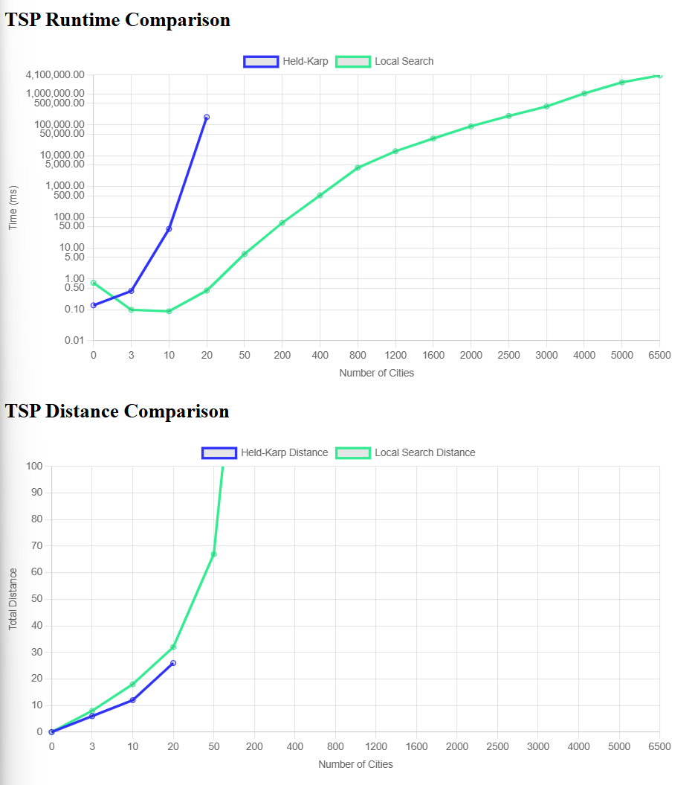

# Traveling Salesperson Problem -- Empirical Analysis

For this exercise, you'll need to take the code from the TSP Held-Karp and TSP
Local Search exercises. This can be your own implementation or somebody else's.
You will now do an empirical analysis of the implementations, comparing their
performance. Both the Held-Karp and the Local Search algorithms solve the same
problem, but they do so in completely different ways. This results in different
solutions, and in different times required to get to the solution.

Investigate the implementations' empirical time complexity, i.e. how the runtime
increases as the input size increases. *Measure* this time by running the code
instead of reasoning from the asymptotic complexity (this is the empirical
part). Create inputs of different sizes and plot how the runtime scales (input
size on the $x$ axis, time on the $y$ axis). Your largest input should have a
runtime of *at least* an hour. The input size that gets you to an hour will
probably not be the same for the Held-Karp and Local Search implementations.

In addition to the measured runtime, plot the tour lengths obtained by both
implementations on the same input distance matrices. The length of the tour that
Held-Karp found should always be less than or equal to the tour length that
Local Search found. Why is this?

Add the code to run your experiments, graphs, and an explanation of what you did
to this markdown file.

### Explanation of what I did
To investigate the implementations' empirical time complexity, I started by 
adding timers to both of my implementations, then making a matrix generator to 
create large inputs. To make the generator, I used your 0 matrix generator from 
the graph representation test code. I then modified it to make sure that the 
random matrices were all undirected, and the distance from each city to itself is 
always 0. To test the generator, I just printed the generated matrices and made 
sure they had all the necessary attributes. I used chatGPT to make a function 
that prints the matrices nicely. 

I tested different sized matrices on the TSP 
algorithms and realized my Held-Karp implementation can only run on a 20 x 20 
matrix before it crashes. So, I decided to graph HK up to where it crashes, then 
figure out what input size takes LS at least an hour and graph it up to that point.
After manually testing a bunch of inputs on LS, I guessed that an input of 6500
cities would take my LS about an hour. I overshot it a little because it ended up
taking about 80 minutes, but 80 minutes is definitely at least an hour. I then 
put 16 inputs from 0-6500 in an array to loop through with my 
randomDistanceMatrix function, made sure HK stopped running on input sizes over 
20, and stored the resulting times and distances in their respective arrays. I 
let the program run, then graphed the results.

I wanted to do the graph in javascript just because everything I've done for this 
class is in js, so I decided to use Chart.js. I was confused by the html 
file so I had chatGPT help me write that. I also used it to debug 
my script.js file which is what created the graphs.

### Analyzing the differences
After getting the graphs to look how I wanted, I analyzed the differences between 
each algorithm. First of all, Held-Karp cannot handle as many inputs as Local 
Search. This is because Local Search has a linear memory complexity since it only
ever stores the current permutation of the route, while Held-Karp has a memory
complexity of $\Theta(|V|\cdot 2^{|V|})$ since the cache stores the number of 
cities times the number of subsets of the cities. 

Though my Local Search's worst case runtime ($\Theta(|V|!\cdot|V|^{3})$) is worse 
than my Held-Karps' ($\Theta(|V|!\cdot|V|^{3})$), there is a very small chance 
that case occurs for LS. Local Search stops searching when it doesn't see any 
more local improvements, so it tends to do less work and take less time. That's 
why, in practice, Local Search often runs much faster than Held-Karp. That's also
why the length of the tour that Held-Karp finds is always less than or equal to 
the tour length that Local Search finds. Held-karp finds the global minimum, 
while Local Search finds the local minimum. On the best case, the local minimum 
can be equal to the global minimum, but it will never be shorter.

### Sources
I used chatGPT where stated in this file

I used [this](https://www.chartjs.org/docs/latest/charts/line.html) to figure out 
how to make a line graph

"I certify that I have listed all sources used to complete this exercise,
including the use of any Large Language Models. All of the work is my own, except
where stated otherwise. I am aware that plagiarism carries severe penalties and
that if plagiarism is suspected, charges may be filed against me without prior
notice."
